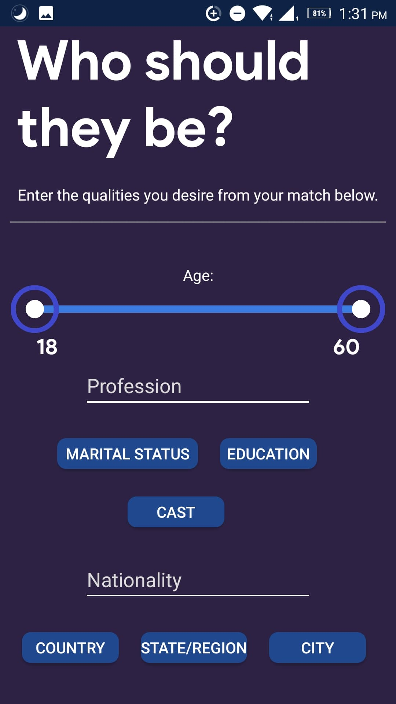

# Arusi
The following library specifies a REST API that takes information requests regarding hockey stats, players, matches and other related content and returns it in an organized manner (in JSON output).  

## Welcome to Arusi
Arusi is a Muslim connections and social pairing application that enables individuals to enter "Rishta" pairing in a new, modern way.
It simplifies the traditional process, is significantly cheaper than older alternatives and ensures you are matched with an individual that
both matches your criteria and personality.

## Usage and testing
* An app bundle of Arusi is available in "Bundle - Final" and can be booted to an android device
* Alternatively, an APK file is available in "~\Arusi\Arusi\app\build\outputs\apk\debug" and can be installed
* The project folder "Arusi" can be opened in Android Studio to view all code, styles and application quickview
